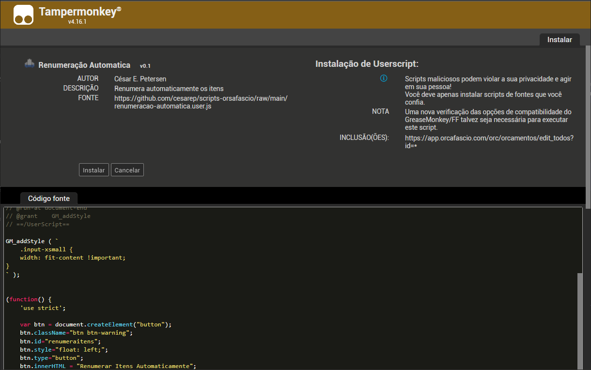

# scripts-orsafascio
Conjunto de _userscripts_ para facilitar utilização do Orçafascio.

## Instalação
1. Instalar o [Tampermonkey](https://www.tampermonkey.net/) ou outro gerenciador de userscripts no navegador.

1. Acessar o painel de opções:

    

1. Na aba de Utilitários, selecionar a opção para importar o arquivo:

    

1. Confirmar a instalação do script:

    

## Scripts disponíveis

- Alteração de BDI em massa:
    
    Adiciona botão para alterar vários BDIs diferenciados ao mesmo tempo.

    

- Filtro de Exclusão em massa:

    Adiciona campos para filtragem por código e descrição de Composições e Insumos na exclusão em massa.

    

- Renumeração Automatica:

    Adiciona botão na página para renumerar automaticamente todos os itens de orçamento. Itens alterados ficam amarelos e exibem mensagem com valor antigo ao passar o mouse por cima.

    

- Selecionar todos os bancos:

    Adiciona opção na exportação do **relatório de composições analíticas com preço unitário** para selecionar todos os bancos exceto o próprio, gerando relatório só com as composições próprias.

    

- Titulos Informativos:

    Modifica o titulo na aba do navegador para incluir o código e descrição dos insumos, composições e orçamentos abertos, organizando melhor as abas.

    

- Mover pastas

    Adiciona botão para mover pastas inteiras nos orçamentos.
    Os botões demoram para aparecer pois precisam carregar toda a estrutura do diretório de pastas antes.

    
    
