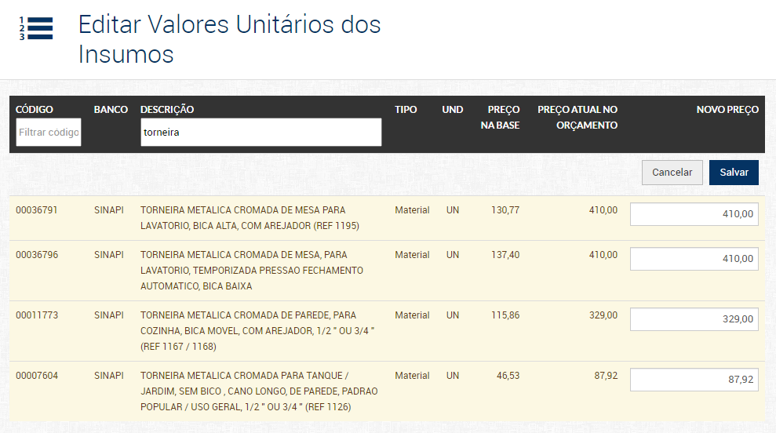
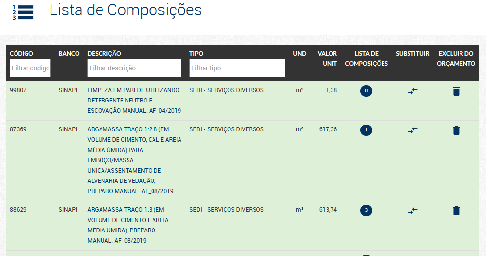
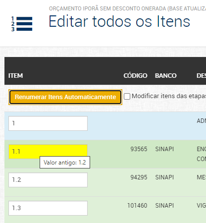
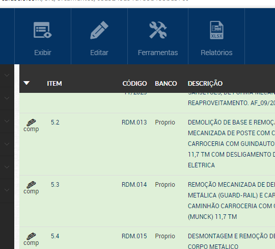
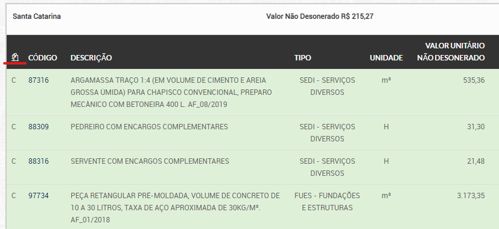
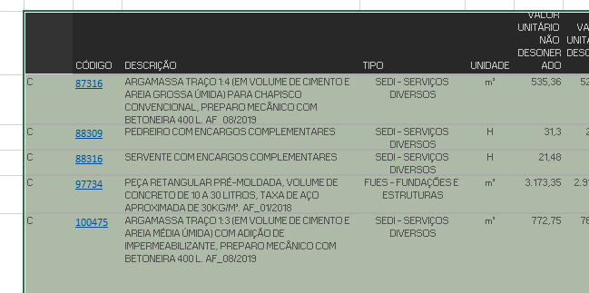
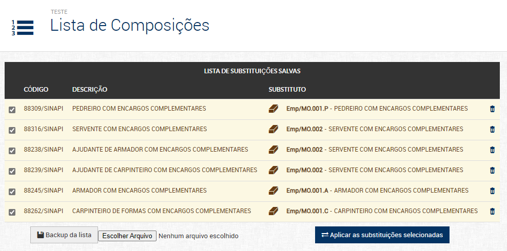

# scripts-orsafascio
Conjunto de _userscripts_ para facilitar utilização do Orçafascio.

## Instalação
1. Instalar o [Tampermonkey](https://www.tampermonkey.net/) ou outro gerenciador de userscripts no navegador.

1. Clicar nos links dos [scripts disponíveis](#scripts-disponíveis).

1. Confirmar a instalação do script:

    

1. Periodicamente o Tampermonkey verifica por atualizações dos scripts

    

## Scripts disponíveis

- [Alteração de BDI em massa](https://github.com/cesarep/scripts-orsafascio/raw/main/alterar-BDI-massa.user.js)
    
    Orçafascio agora inclui página para alteração dos BDIs diferenciados, funcionalidades antigas foram movidas para lá:

    

    Inclui campos para substituir todos os BDIs diferentes ao mesmo tempo e funções para copiar e colar planilha compatível Excel com a relação de itens e BDIs.

    

- [Filtro de Exclusão em massa](https://github.com/cesarep/scripts-orsafascio/raw/main/filtro-exclusao-massa.user.js)

    Adiciona campos para filtragem de Composições e Insumos na exclusão em massa.

    

- [Filtro de Edição de Preços](https://github.com/cesarep/scripts-orsafascio/raw/main/filtro-edicao-precos.user.js)

    Adiciona campos para filtragem de insumos na edição dos valores unitários

    

- [Filtro de Composicoes](https://github.com/cesarep/scripts-orsafascio/raw/main/filtro-comps-orcamento.user.js)

    Adiciona campos para filtragem de composições na listagem de composições do orçamento

    

- [Renumeração Automatica](https://github.com/cesarep/scripts-orsafascio/raw/main/renumeracao-automatica.user.js)

    Adiciona botão na página para renumerar automaticamente todos os itens de orçamento. 
    Também um checkbox para o modo de renumeração dos subitens das etapas, essa renumeração é feita com base nos valores salvos originais, portanto, deve-se salvar os valores após a renumeração automatica, caso seja utilizada.
    Itens alterados ficam amarelos e exibem mensagem com valor antigo ao passar o mouse por cima.

    
    

- [Exclusão de etapas vazias](https://github.com/cesarep/scripts-orsafascio/raw/main/excluir-etapas-vazias.user.js)

    Adiciona botão na página para selecionar as etapas vazias para exclusão.

    

- [Selecionar todos os bancos](https://github.com/cesarep/scripts-orsafascio/raw/main/selecionar-todos-bancos.user.js)

    Adiciona opção na exportação do **relatório de composições analíticas com preço unitário** para selecionar todos os bancos exceto o próprio, gerando relatório só com as composições próprias.

    

- [Copia e Colar Bancos](https://github.com/cesarep/scripts-orsafascio/raw/main/mudar-bancos.user.js)

    Adiciona botões para copiar e colar os bancos de maneira simplificada através de uma tabela do Excel nos menus de orçamentos e composições.

    

    A tabela deve estar com os nomes dos bancos e valores iguais aos presentes no site, conforme exemplo na tabela direita. O banco copiado pode ser colado no Excel, ele apresenta um apóstrofe `'` na frente para evitar a auto-formatação das datas e números, como mostrado na tabela esquerda, cada valor pode ser reeditado para aplicar a formatação de texto e esconder a apóstrofe (Dica: pressionar `F2` e `Enter`). O script ignora as apóstrofres, de maneira que uma lista de bancos também pode ser diretamente copiada e colada em outra página sem intermédio do Excel.

    

- Titulos Informativos para [Orçamentos e Pastas](https://github.com/cesarep/scripts-orsafascio/raw/main/titulo-informativo-orcs.user.js) e [Insumos e Composições](https://github.com/cesarep/scripts-orsafascio/raw/main/titulo-informativo-comps-ins.user.js)

    Modifica o titulo na aba do navegador para incluir o código e descrição dos insumos, composições, orçamentos e pastas abertas, organizando melhor as abas.

    

- [Tabela Fixa](https://github.com/cesarep/scripts-orsafascio/raw/main/tabela-fixa.user.js)

    Fixa a linha superior da tabela de orçamento.

    

- [Selecionar Itens na ABC de Insumos](https://github.com/cesarep/scripts-orsafascio/raw/main/selecionar-itens-abc-insumos.user.js)

    Adiciona botões radio para fácilmente selecionar um único item para o relatório da curva ABC de Insumos, e botão para incluir comparação com preços da base, anteriormente só disponível por dentro do menu de insumos.

    
    

- [Copiar Tabela de Composições](https://github.com/cesarep/scripts-orsafascio/raw/main/copiar-tabela-comp.user.js)

    Adiciona botão no topo das tabelas de composições para facilmente copia-las para o Excel.

    
    

- [Substituição de Composições](https://github.com/cesarep/scripts-orsafascio/raw/main/subst-comp.user.js)

    Adiciona opção de salvar e gerenciar lista de substituições de composições para aplicação simultânea. Pode ser necessário aplicar mais de uma vez para trocar todas as composições.

    
    